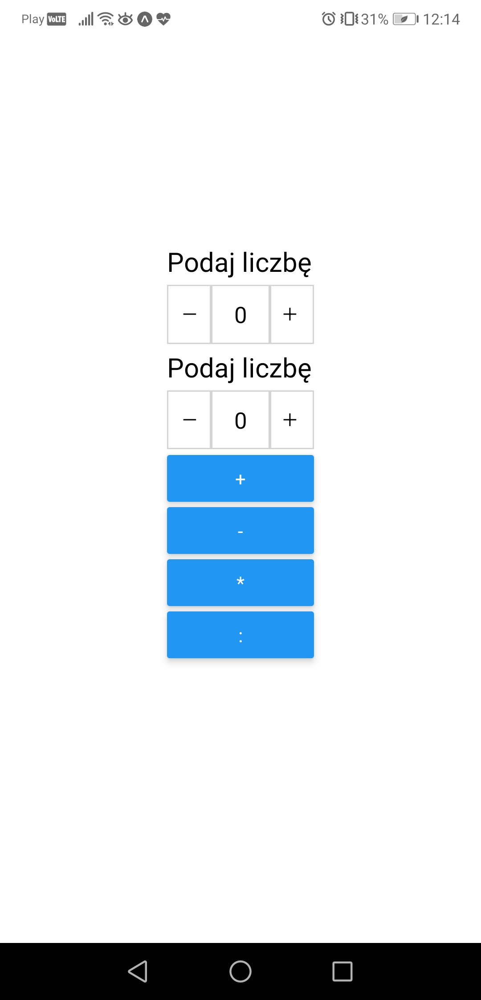
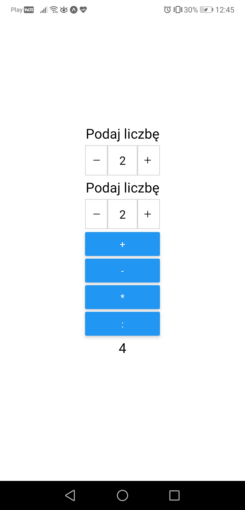

# Aplikacje Mobilne Lab 1

Celem laboratorium była instalacja pakietów, konfiguracja środowiska i wykonanie prostej aplikacji - kalkulatora. Zadanie wykonałem z użyciem React Native. Poza standardowymi komponentami z pakietu react-native, wykorzystałem komponent NumericInput z pakietu rn-numeric-input.

Działnie aplikacji:
```jsx
<NumericInput 
    onChange={value => setValue1(value)} 
/>
<NumericInput
    onChange={value => setValue2(value)}
/>
<Button
    title = "+"
    onPress = { () => {
        setResult(value1 + value2)
    }}
/>
<Text style = {styles.txt}>{result}</Text>
```
Podajemy pierwszą i drugą liczbę w komponentach NumericInput. Prop onChange ustawi wartości value1 i value2. Następnie wybieramy działanie (tutaj dodawanie) po naciśnięciu przycisku ustawiana jest wartość result. Która wyświetla się w komponencie Text.


