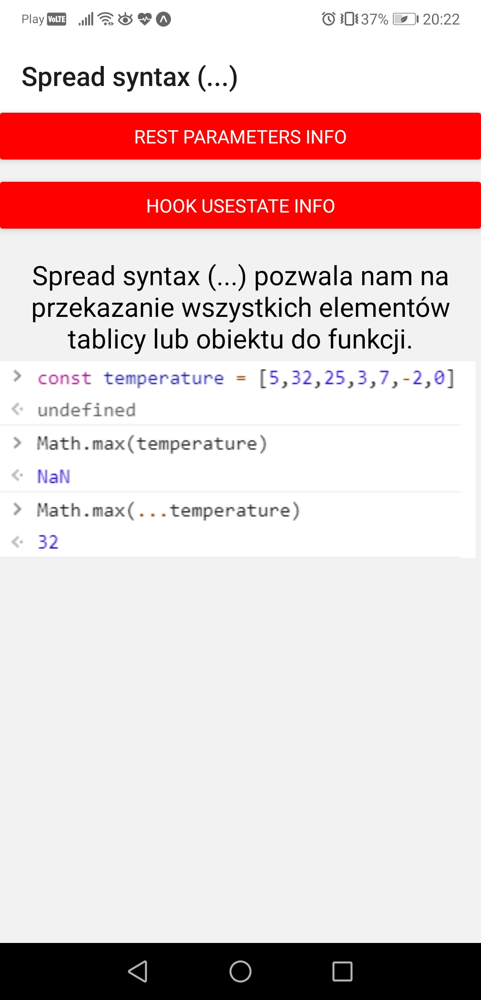
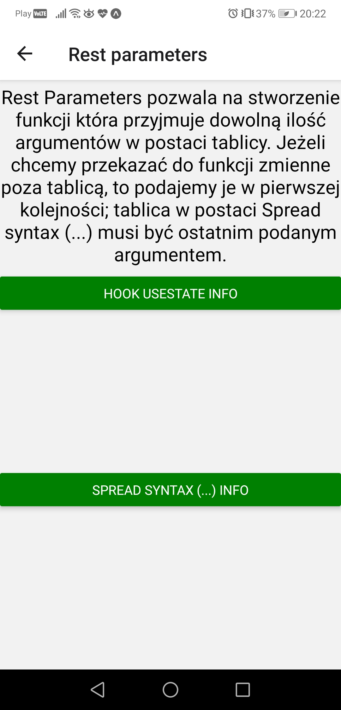
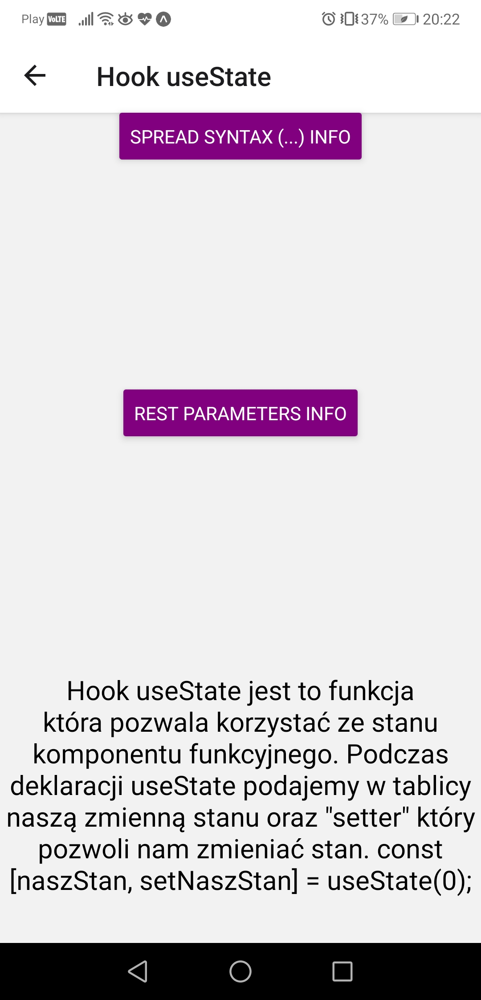

# Aplikacje Mobilne Lab 2

Celem laboratorium było zapoznanie się z koncepcja flexboxa oraz nawigacją pomiędzy ekranami z użyciem react-navigation. W tym celu należało stworzyć 3 ekrany pomiedzy którymi można nawigować, ostylowane na różne sposoby.

