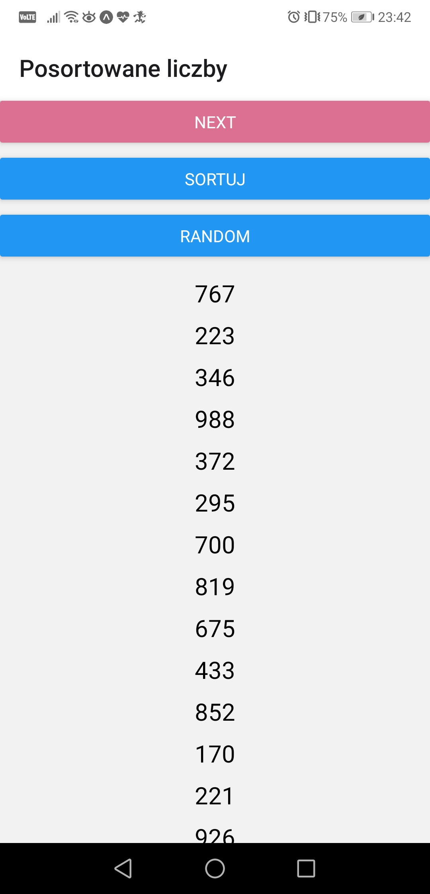
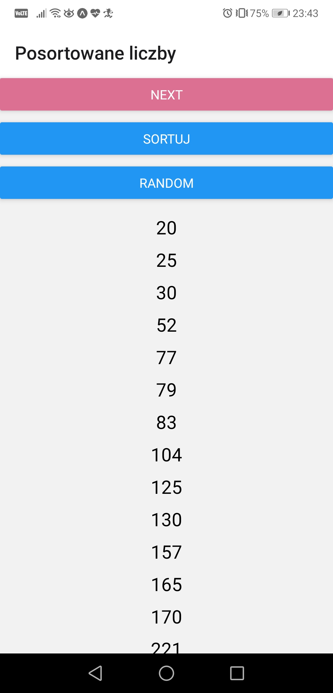
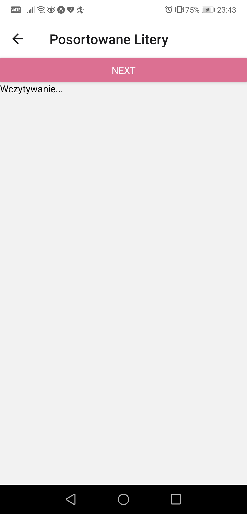
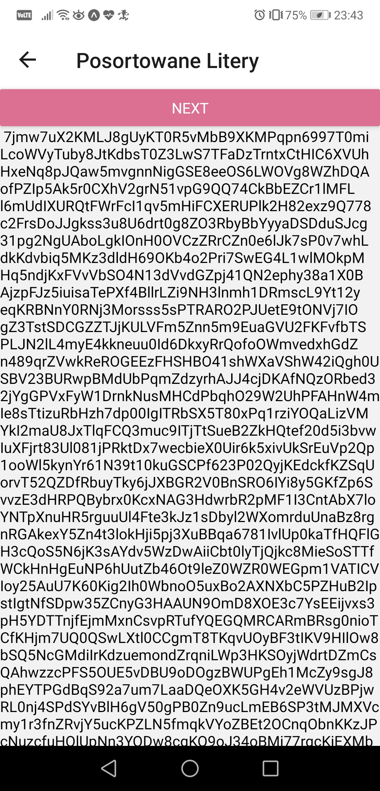
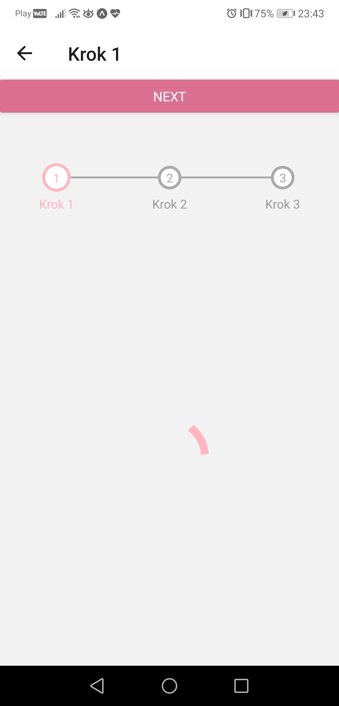
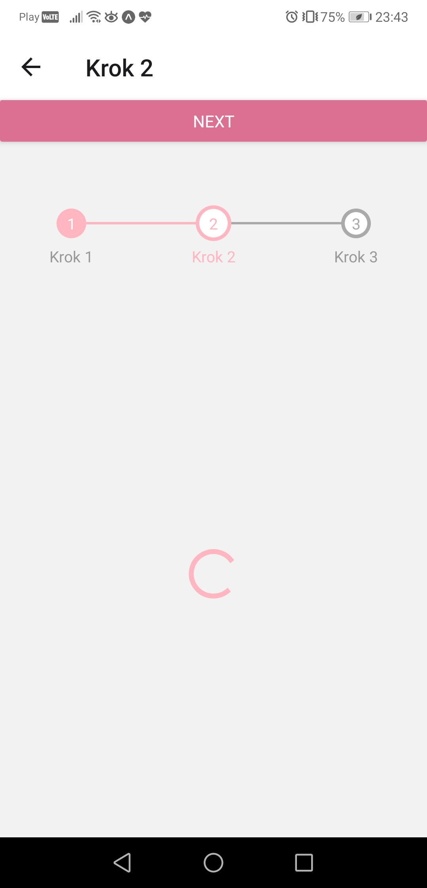
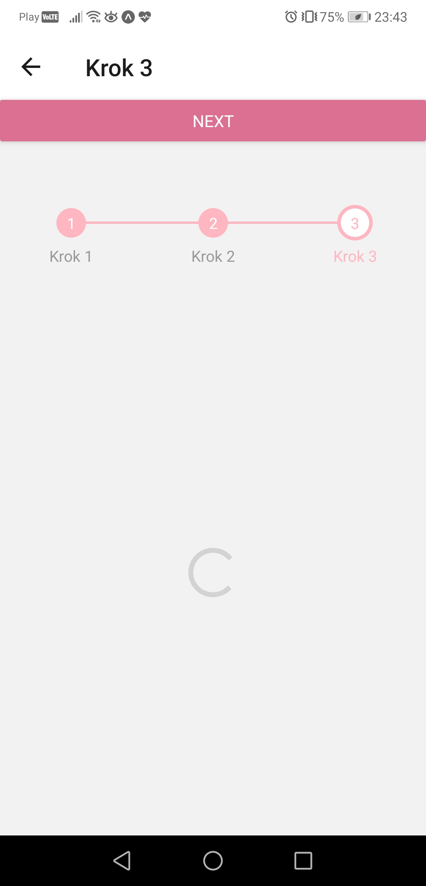

# Aplikacje Mobilne Lab 3

Celem laboratorium było odświeżenie sobie działań na tablicach w JavaScript, zapoznanie się lazy loading, step progress oraz ActivityIndicator. Do przedstawienia progresu wykorzystałem [react-native-step-indicator](https://www.npmjs.com/package/react-native-step-indicator?fbclid=IwAR1q5r1kcWvEl74QUzaQlxnkIpxO9C2S-8tq2uL9WgQLbzwjASHbED4juu8).

## Stworzenie listy losowych liczb i sortowanie ich

## Lazy Loading

## Step progress

