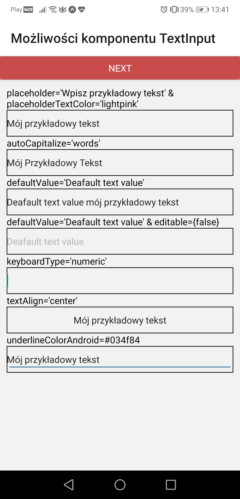

# Aplikacje Mobilne Lab 4

Celem laboratorium było zapoznanie się/pogłębienie więdzy o komponentach: TextInput, DateTimePicker, Picker, Switch, Modal, Alert, ToastAndroid.

## TextInput
Na zrzucie poniżej widać komponenty TextInput z zastosowaniem różnych propsów.

v

Widok klawiatury "numeric"

Widok po wpisaniu "Mój przykładowy tekst" do inputów

## Select
Poniżej widać obsługę komponentu Picker

## Switch & Modal
Poniżej widać zaimplementowany komponent switch, jego kolor zmienia się po naciśnięciu.

Po naciśnięciu wyskakuje okno - modal z pseudolosową liczbą

## Wybór daty i czasu
Poniżej widok czwartego okna z trzema guzikami - możliwością wybrania daty, godziny oraz wyświetlenia ich za pomocą komponentu Alert.

Widok wyboru daty

Widok wyboru godziny

Alert z wybraną datą i godziną, zadbałem  o prawidłowe format wyświetlania - dni, miesiące, godziny i minuty "mniejsze" niż 10 mają dodane 0 z przodu.

## Toast

Poniżej widać switch - taki sam jak w punkcie trzecim, po jego wciśnięciu pojawia się modal z wyświetlonym czasem po jakim zniknie, oraz komponent Toast

