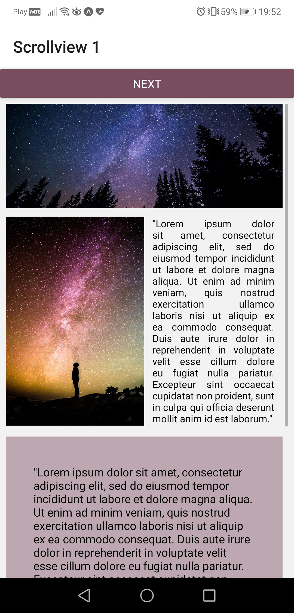
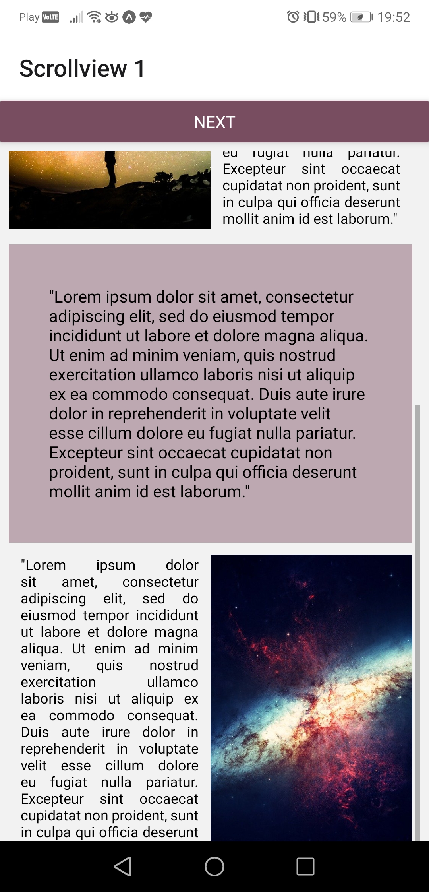
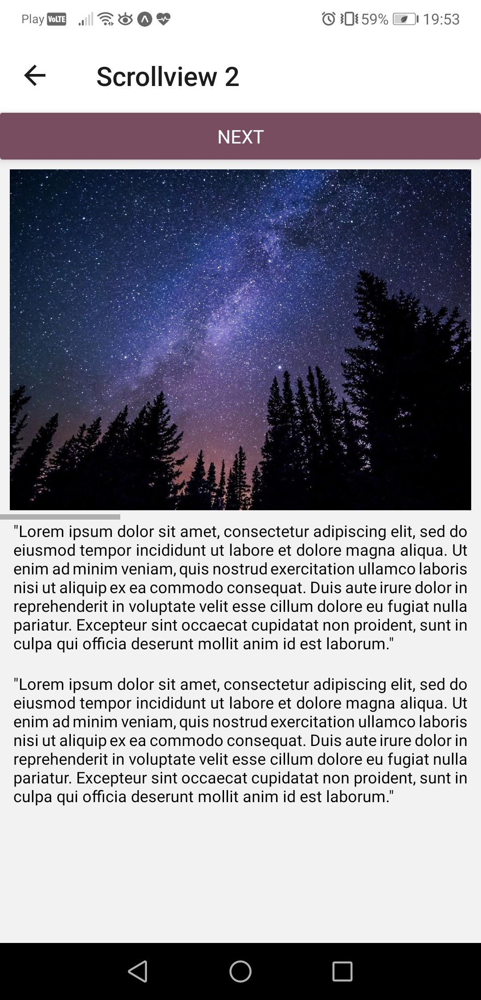
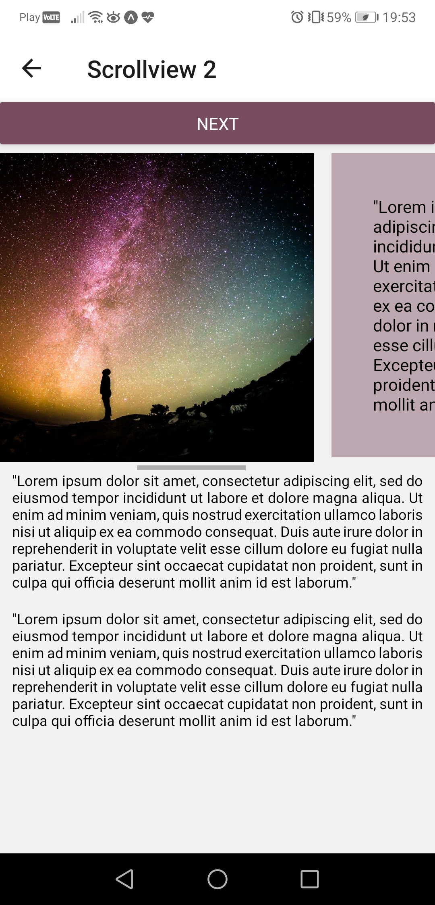
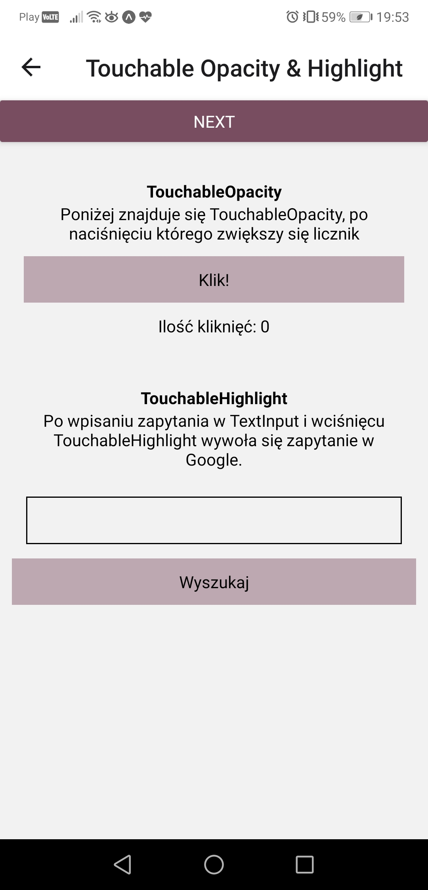
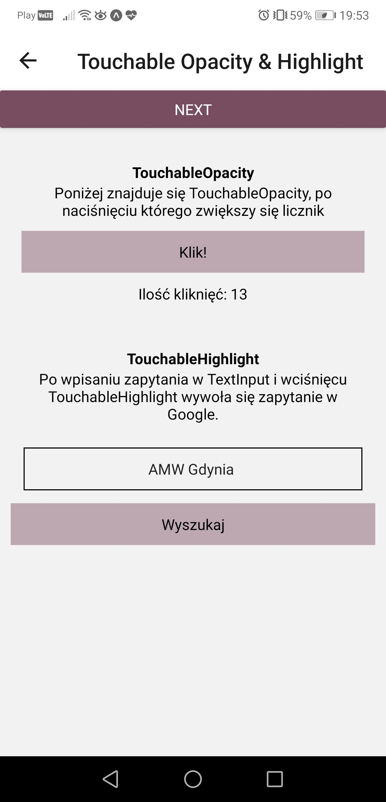
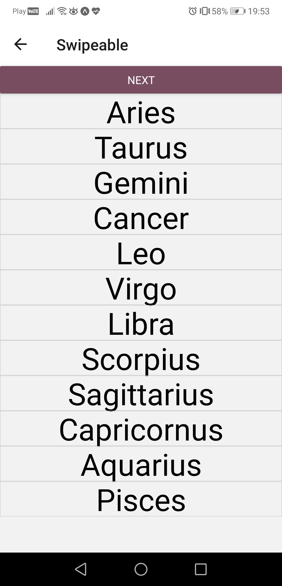
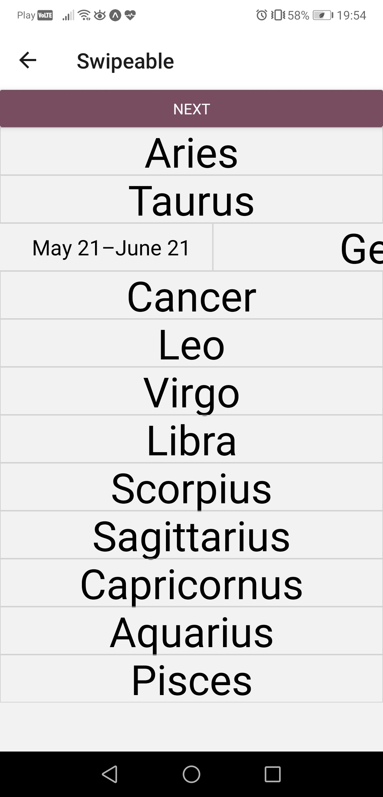
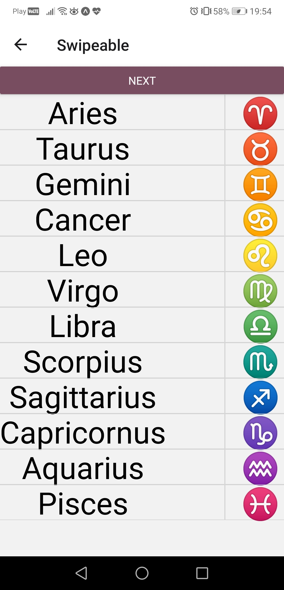

# Aplikacje Mobilne Lab 5

Celem laboratorium było zapoznanie się z obsługa gestów użytkownika poprzez implementację komponentów ScrollView, TouchableOpacity, TouchableHighlight i Swipeable. Dodatkowo można było zapoznać się i wykorzystać komponent WebView.

## ScrollView
Na pierwszym i na drugim ekranie należało zaimplementować użycie komponentu ScrollView, na każdym z nich miały być różne style (Flexbox) oraz widoczny pasek przewijania (scrollbar). Aby wypełnić komponent ScrollView treścią skopiowałem tekst "Lorem Ipsum" i wykorzystałem darmowe grafiki ze strony pixabay.com/pl

### ScrollView 1
Na poniższych zrzutach widać ekran stanie początkowym oraz po przewinięciu na sam dół.

### ScrollView 2
Na drugim ekranie zaimplementowałem komponent ScrollView z propsem horizontal ustawionym na true. Poniżej widać ekran w stanie początkowym oraz w trakcie przewijania.

## TouchableOpacity i TouchableHighlight
Na trzecim ekranie zaimplementowałem komponenty TouchableOpacity i TouchableHighlight. TouchableOpacity wykorzystałem jako guzik do prostego licznika kliknięć, a TouchableHighlight użyłem jako przycisk wyszukiwania w Google(z użyciem WebView) frazy wpisanej w TextInput'cie powyżej. Na poniższych zrzutach widać stan początkowy ekranu, stan po naciśnięciu guzika licznika kilkanaście razy i wpisaniu frazy do TextInputa oraz modal z WebView z zapytaniem w Google.

## Swipeable
Na czwartym ekranie należało zaimplementować obsługę przesunięć palcem za pomocą komponentu Swipeable. Na zrzutach widać stan początkowy, przesunięcie komponentu w prawo oraz przesunięcie wszystkich komponentów w lewo.

