# Aplikacje Mobilne Lab 6

Celem laboratorium było zapoznanie się z obsługą obrazów oraz działaniem aplikacji z, oraz bez dostępu do internetu.

## Image
Na pierwszym ekranie należało zaimplementować komponent Image z użyciem właściwości 'uri' oraz metody require. v

```JSX
import React from 'react';
import { View, Image } from 'react-native';

import styles from '../styles'

const ScreenOne = () => {
    return (
        <View>
            {/* wygląda na to że stylowanie plików dodanych metodą require nie jest inteligente,
                po ostylowaniu wysokości szerokość nie miała odpowiednich proporcji a obraz się rozjechał, musiałem dodać width: '100%' */}
            <Image
                style = {styles.screenOne.img}
                source={require('../images/architecture.jpg')}
            />
            <Image
                style = {styles.screenOne.img}
                source = {{uri: 'https://cdn.pixabay.com/photo/2015/06/08/15/02/pug-801826_1280.jpg'}}
            />
        </View>
    )
}

export default ScreenOne;
```


## Slider

Na drugim ekranie należało zaimplementować komponent Slider. Poniżej widać sposób implementacji oraz zrzut ekranu działającej aplikacji.

```JSX
import React, { useState } from 'react';
import { View, Image } from 'react-native';
import Slider from '@react-native-community/slider';

import styles from '../styles'

const ScreenTwo = () => {
    const [scaleOne, setScaleOne] = useState(1);
    const [scaleTwo, setScaleTwo] = useState(1);

    return (
        <View>
            <Image
                style = {[styles.screenOne.img, {transform: [{scale: 1*scaleOne}]}]}
                source={require('../images/architecture.jpg')}
            />
            <Slider
                style={{width: '100%', height: 40}}
                value={1}
                minimumValue={0.1}
                maximumValue={1}
                minimumTrackTintColor="#FFFFFF"
                maximumTrackTintColor="#000000"
                onValueChange={(value) => setScaleOne(value)}
            />
            <Image
                style = {[styles.screenOne.img, {transform: [{scale: 1*scaleTwo}]}]}
                source = {{uri: 'https://cdn.pixabay.com/photo/2015/06/08/15/02/pug-801826_1280.jpg'}}
            />
            <Slider
                style={{width: '100%', height: 40}}
                value={1}
                minimumValue={0.1}
                maximumValue={1}
                minimumTrackTintColor="#FFFFFF"
                maximumTrackTintColor="#000000"
                onValueChange={(value) => setScaleTwo(value)}
            />
        </View>
    )
}

export default ScreenTwo;
```
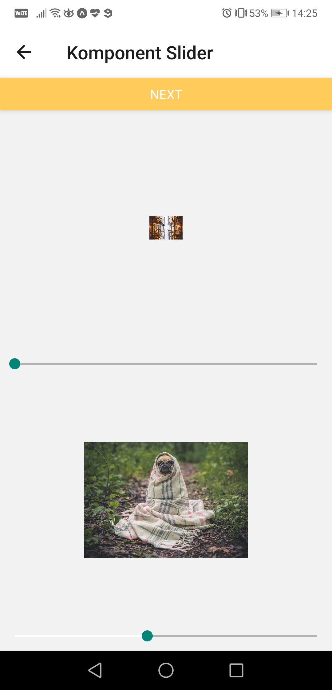

## Lazy Loading

Na trzecim ekranie należało zaimplementować "leniwe ładowanie" obrazu oraz dowolny zestaw ikon. Dodałem po 5 ikon zestawów AntDesign i Feather z paietu @expo/vector-icons. Do lazyloading wykorzystałem komponent Image z propsem 'PlaceholderContent' z 'react-native-elements'. Poniżej widać sposób implementacji oraz zrzut ekranu działającej aplikacji.

```JSX
import React from 'react';
import { ActivityIndicator, View } from 'react-native';
import { Image } from 'react-native-elements';
import { AntDesign, Feather } from '@expo/vector-icons';

import styles from '../styles'

const ScreenThree = () => {
    return (
       <View style={styles.global.container}>
            <Image
                source={{ uri: 'https://images.unsplash.com/photo-1618375929669-5e7e592579b5?ixlib=rb-1.2.1&ixid=MnwxMjA3fDB8MHxwaG90by1wYWdlfHx8fGVufDB8fHx8&auto=format&fit=crop&w=1868&q=80' }}
                style={styles.screenThree.img}
                PlaceholderContent={<ActivityIndicator size='large' color='#cca349'/>}
            />
            <View style={styles.screenThree.container}>
                <AntDesign name='user' size={24} color="black" />
                <AntDesign name='shoppingcart' size={24} color="black" />
                <AntDesign name='videocamera' size={24} color="black" />
                <AntDesign name='setting' size={24} color="black" />
                <AntDesign name='lock' size={24} color="black" />
            </View>
            <View style={styles.screenThree.container}>
                <Feather name='coffee' size={24} color='black' />
                <Feather name='activity' size={24} color='black' />
                <Feather name='calendar' size={24} color='black' />
                <Feather name='headphones' size={24} color='black' />
                <Feather name='power' size={24} color='black' />
            </View>

       </View>  
    )
}

export default ScreenThree;
```

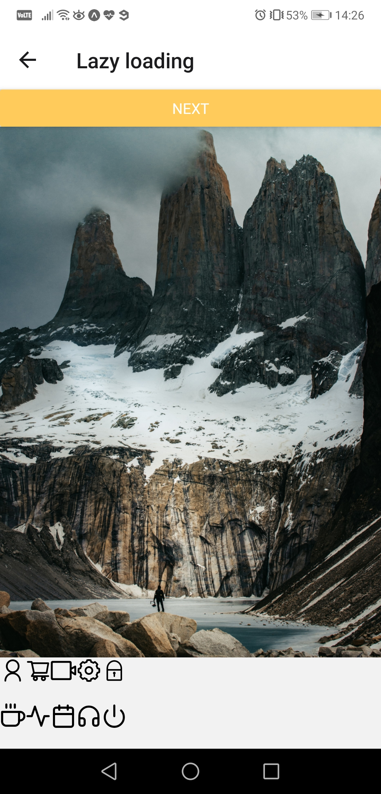

## Detekcja łączności

Na czwartym ekranie należało zaimplementować detekcję łącznośći z siecią za pomocą komponentu NetInfo. Poniżej widać sposób implementacji oraz zrzuty ekranu działającej aplikacji w przypadku kolejno: połączenia z siecią wifi, wykorzystaniem danych komórkowych oraz braku połączenia. 

```JSX
import React from 'react';
import { View, Text } from 'react-native';
import { useNetInfo } from "@react-native-community/netinfo";

import styles from '../styles'

const ScreenFour = () => {
    const netInfo = useNetInfo();
    var netInfoDetails = netInfo.details ? JSON.parse(JSON.stringify(netInfo.details,null)) : '';

    return (
        <View>
            <Text style={styles.screenFour.txt}>Jest połączenie? - {netInfo.isConnected ? `tak` : 'nie'}</Text>
            <Text style={styles.screenFour.txt}>Typ połączenia: {netInfo.type}</Text>
            <Text style={styles.screenFour.txt}>Adres IP: {netInfoDetails.ipAddress}</Text>
            <Text style={styles.screenFour.txt}>Jakość połączenia: {netInfoDetails.strength}%</Text>
            <Text style={styles.screenFour.txt}>Częstotliwość: {netInfoDetails.frequency} MHz</Text>
        </View>
    )
}

export default ScreenFour;
```

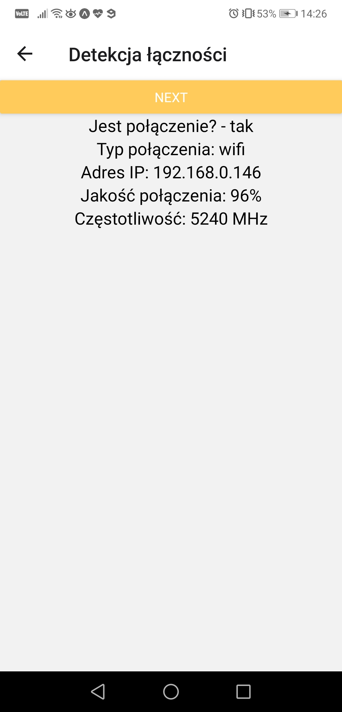

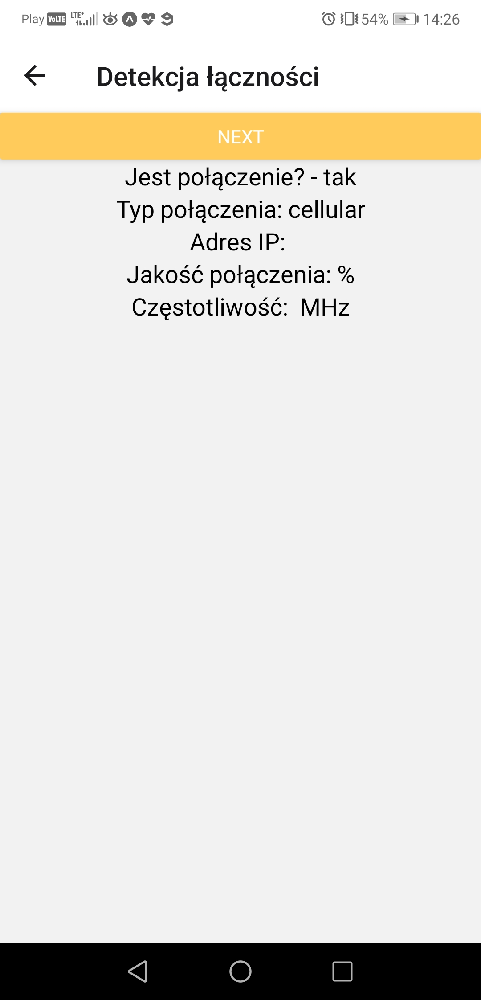

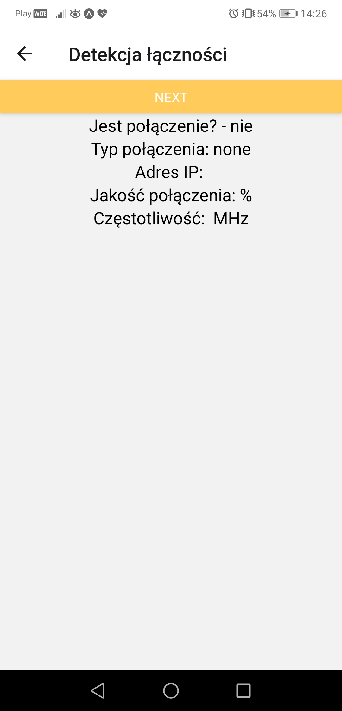

## Async Storage

Na piątym ekranie należało zaimplementować obsługę zapisu danych aplikacji za pomocą AsyncStorage. W przgotowanym przeze mnie przykładzie podajemy klucz oraz wartość w TexInputach następnie zatwierdzamy dodanie danych, żeby te dane pobrać w trzecim TextInput'cie podajemy wartość klucza i zatwierdzamy. Po każdej oparcji pojawi się odpowiedni Toast. Poniżej widać sposób implementacji oraz zrzuty ekranu działającej aplikacji w kolejnych opisanych krokach.

```JSX
import React, { useState } from 'react';
import { View, Text, TextInput, Button, ToastAndroid } from 'react-native';
import AsyncStorage from '@react-native-async-storage/async-storage';
import styles from '../styles';

const storeData = async (key, value) => {
    try {
        await AsyncStorage.setItem(key, value)
        ToastAndroid.show("Poprawnie zapisano dane", ToastAndroid.SHORT)
    } 
    catch (e) {
        ToastAndroid.show("Błąd! Dane nie zostały zapisane", ToastAndroid.SHORT)
    }
}

const getData = async (key) => {
    try {
        const value = await AsyncStorage.getItem(key)
        if(value !== null) {
        ToastAndroid.show(value, ToastAndroid.SHORT)
      }
    } 
    catch(e) {
        ToastAndroid.show("Błąd! Nie udało się pobrać danych", ToastAndroid.SHORT)
    }
  }
  

const ScreenFive = () => {
    const [key, setKey] = useState('');
    const [value, setValue] = useState('');
    const [searchKey, setSearchKey] = useState('');

    return (
        <View style={styles.global.container}>
            <View style={styles.global.container}>
                <Text style={styles.screenFive.txt}>Podaj klucz:</Text> 
                <TextInput
                    style={styles.global.txtInput}
                    onChangeText = {text => setKey(text)}
                    value = {key}
                />
                <Text style={styles.screenFive.txt}>Podaj wartość:</Text>
                <TextInput
                    style={styles.global.txtInput}
                    onChangeText = {text => setValue(text)}
                    value = {value}
                />
                <Button
                    color = '#cca349'
                    onPress = {() => storeData(key,value)}
                    title = 'Zapisz dane'
                />
            </View>
            <View style={styles.global.container}>
                <Text style={styles.screenFive.txt}>Podaj klucz dla jakiego chcesz znaleźć wartość:</Text>
                <TextInput
                    style={styles.global.txtInput}
                    onChangeText = {text => setSearchKey(text)}
                    value = {searchKey}
                />
                <Button
                    color = '#cca349'
                    onPress = {() => getData(searchKey)}
                    title = 'Pobierz dane'
                />
            </View>
        </View>
    )
}

export default ScreenFive;
```

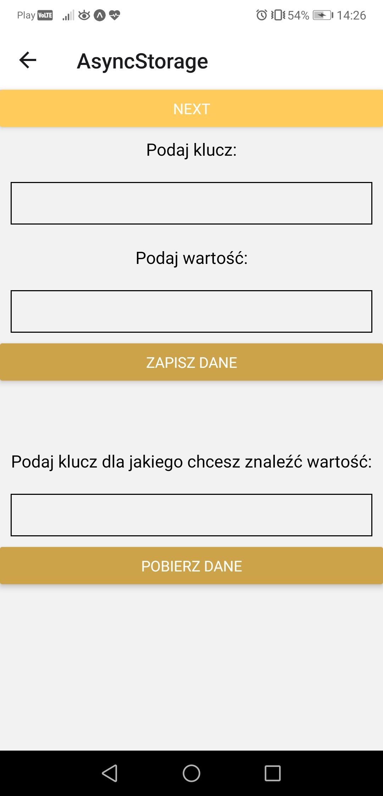

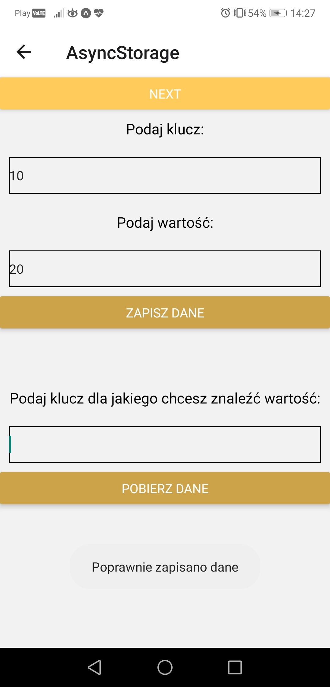

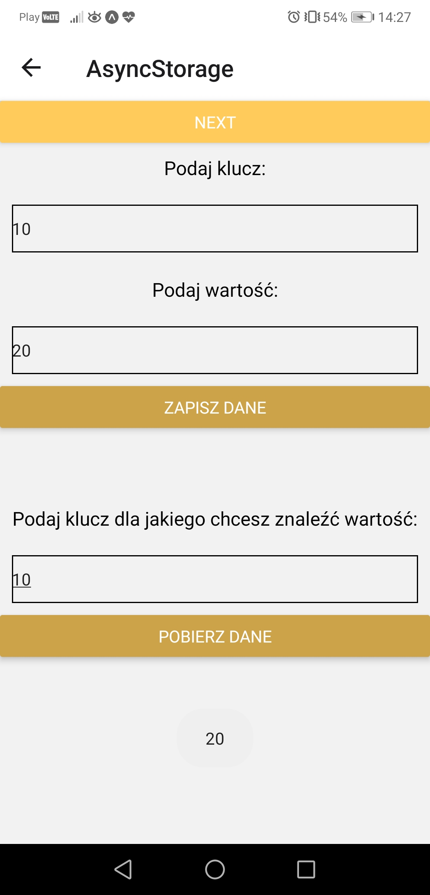

## Synchronizacja danych

Na szóstym ekranie należało zaimplementować obsługę synchronizacji danych aplikacji, w przypadkach łączności z siecią i jej braku. W przgotowanym przeze mnie przykładzie widać informacje o połączeniu z siecią, poniżej znajduje się TextInput a pod nim teksty - "Wartość 'offline'" i "Wartość 'online'". To co wpiszemu do inputa zostanie wpisane na końcu obu tekstów gdy mamy połączenie z internetem, gdy połączenia nie ma zostanie zaktualizowany tekst 'offline', gdy znowu będzie połącznie z siecią nastąpi synchronizacja danych i tekst 'online' również się zaktualizuje. Poniżej widać sposób implementacji oraz zrzuty ekranu działającej aplikacji w stanie początkowym i w kolejnych opisanych krokach.

```JSX
import React, { useState } from 'react';
import { View, Text, TextInput } from 'react-native';
import NetInfo, { useNetInfo } from "@react-native-community/netinfo";

import styles from '../styles'

const dataSynchronisation = (text, setLocalData, setRemoteData, connection) => {
    setLocalData(text);
    if(connection) setRemoteData(text);
    else {
        const unsubscribe = NetInfo.addEventListener(state => {
            if(state.isConnected) {
                unsubscribe(); 
                setRemoteData(text);
            }
        })
    }
}

const ScreenSix = () => {
    const netInfo = useNetInfo();
    const [localData, setLocalData] = useState('');
    const [remoteData, setRemoteData] = useState('');

    return (
        <View>
            <View>
                <Text style={styles.screenSix.txt}>Jest połączenie? - {netInfo.isConnected ? `tak` : 'nie'}</Text>
                <Text style={styles.screenSix.txt}>Typ połączenia: {netInfo.type}</Text>
            </View>
            <View>
                <TextInput
                    style = {styles.global.txtInput}
                    onChangeText = {text => {dataSynchronisation(text, setLocalData, setRemoteData, netInfo.isConnected)}}
                />
            </View>
            <View>
                <Text style={styles.screenSix.txt}>Wartość 'offline': {localData}</Text>
                <Text style={styles.screenSix.txt}>Wartość 'online': {remoteData}</Text>
            </View>
        </View>
    )
}

export default ScreenSix;
```

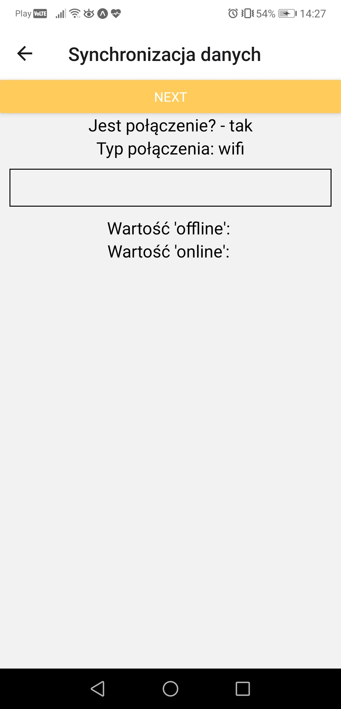

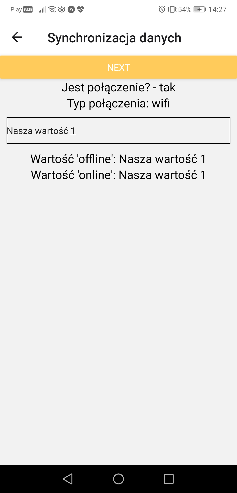

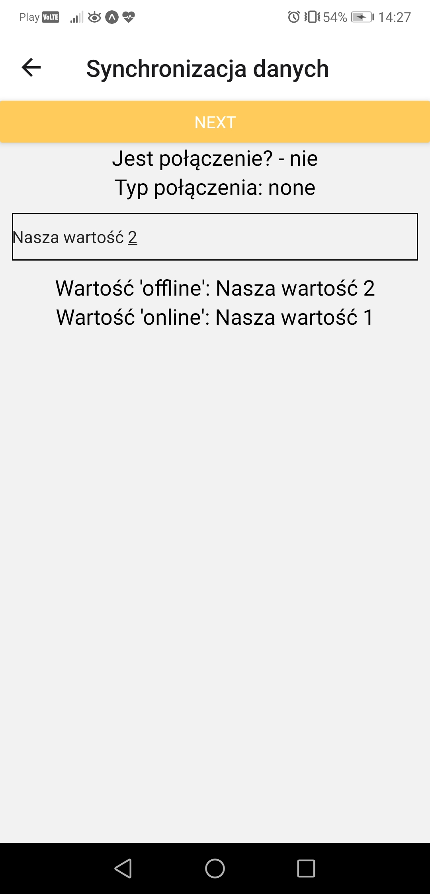

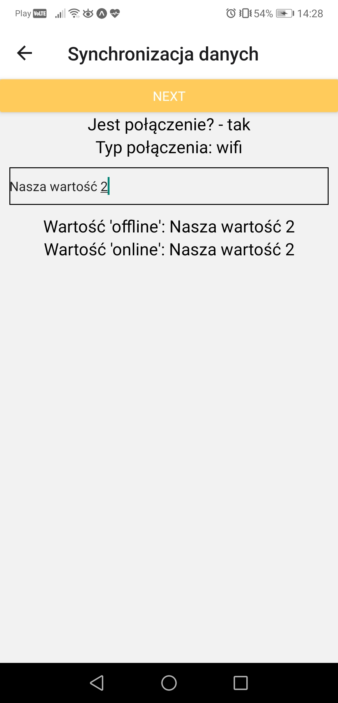